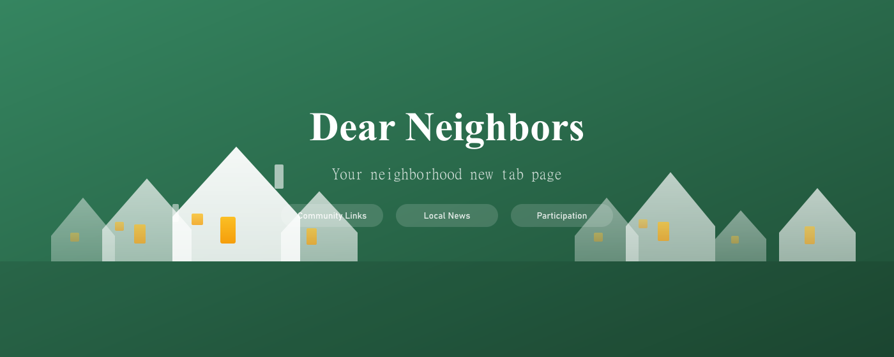

# Dear Neighbors

[](https://github.com/Citizen-Infra/dear-neighbors/actions/workflows/package.yml)



Chrome extension that replaces the new tab page with a neighborhood dashboard. Community-curated local news links and participation opportunities (deliberation sessions, conversations, community meetings) scoped to your city and neighborhood.

Part of the [NSRT](https://github.com/Citizen-Infra/nsrt) (Novi Sad Relational Tech) citizen infrastructure ecosystem.

## How it works

- **Pick your location** — Country → City → Neighborhood (or "all neighborhoods")
- **Browse community links** — Sorted by hot score or newest, filtered by topics
- **Share links** — Submit relevant local news, events, and resources via the new tab page or browser popup
- **Vote** — Upvote links that matter to your neighborhood
- **Participate** — See live, upcoming, and completed participation opportunities (Harmonica sessions, Polis conversations, etc.)


## Setup

```bash
cd extension
npm install
npm run build
```

Load the extension at `chrome://extensions` → Developer mode → Load unpacked → select `extension/dist/`. Then pin the extension in Chrome's toolbar (puzzle icon → pin Dear Neighbors) to access the quick share popup.

Requires `VITE_SUPABASE_URL` and `VITE_SUPABASE_ANON_KEY` environment variables (see `.env.example` or set in your shell).

## Architecture

- **Extension** — Preact + @preact/signals, Vite, custom CSS with dark mode
- **Backend** — Supabase (Postgres + Auth + RLS + Edge Functions)
- **Hierarchy** — Country → City → Neighborhood → Block
- **Two entry points** — New tab dashboard + browser action popup

See [CLAUDE.md](./CLAUDE.md) for detailed architecture notes.

## Coverage

111 countries with capital cities seeded. Major cities added for US, UK, EU, India, Japan, South Korea, Australia, New Zealand, South Africa, Brazil, Argentina, Chile, and Mexico. Neighborhoods seeded for Novi Sad, Belgrade, London, Auckland, Wellington, Toronto, New York, Los Angeles, and Houston — more added as communities grow.

## Changelog

### [0.1.8] - 2026-02-02
- Move URL metadata fetch to server-side edge function
- Narrow `host_permissions` from `<all_urls>` to specific domains
- Citizen Infra about footer in Settings modal
- Chrome Web Store listing assets

### [0.1.7] - 2026-02-02
- Move auth into Settings modal and add optional sign-in step to onboarding
- New neighborhood houses icon (replaces plain green square)
- US AQI scale for non-European countries, European AQI for EU/EEA
- Flag emojis in language selector

### [0.1.6] - 2026-02-02
- Language support: UI i18n (English/Serbian), content language filter, auto-detect from browser locale
- Onboarding modal for new users to pick city and language on first visit
- Live AQI and UV index badges in the top bar
- Neighborhoods for Belgrade, London, Auckland, Wellington, Toronto, New York, Los Angeles, and Houston (10 each)
- Toronto added as a city under Canada
- New tab page title changed to "New Tab"

### [0.1.5] - 2026-02-01
- Share/vote buttons now open sign-in modal instead of silently doing nothing
- Show "Too many attempts" error when Supabase email rate limit is hit
- Add "check your spam folder" hint after magic link is sent

### [0.1.4] - 2026-02-01
- Replace DMG packaging with single ZIP for all platforms
- Single CI job instead of two parallel jobs (fixes release race condition)
- CHANGELOG.md, Dependabot for weekly npm security updates, CI badge in README
- Sync package.json version with manifest.json

### [0.1.3] - 2026-02-01
- Downvote arrow to remove your own votes
- "Top" sort tab ordered by vote count, with Week/Year/All time range picker

### [0.1.2] - 2026-02-01
- Auto-fetch page title and description when pasting a URL in the submit form
- Topic chip pill styles in the submit form
- `user_voted` flag in links view
- Vote toggle now scoped to current user

### [0.1.1] - 2026-02-01
- Link deletion for submitters and admins
- Pin-the-extension instructions in README
- Link submission now defaults `submitted_by` to current user
- Renamed neighborhood type from `mesna_zajednica` to `neighborhood`

### [0.1.0] - 2026-01-31
- Neighborhood dashboard replacing Chrome new tab page
- Hierarchical location selection (country / city / neighborhood)
- Community links feed with hot-ranking and voting
- Participation opportunities panel (live/upcoming/completed sessions)
- Browser popup for quick link sharing from any page
- Magic link authentication via Supabase
- Light/dark/system theme support
- 111 countries, 340+ cities seeded

## License

Private — Citizen Infrastructure / NSRT
